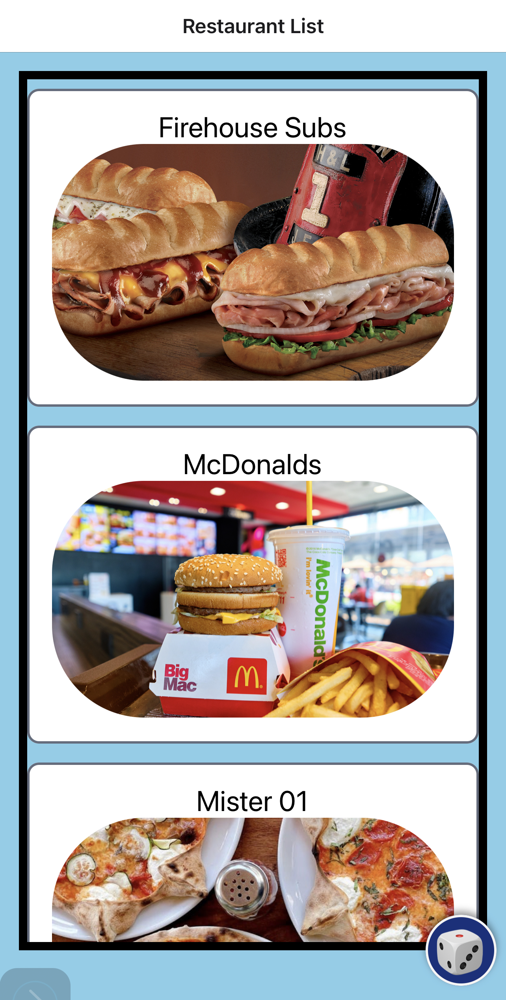

# Lunch-spot

Boca Code Week 6 Lunch Spot: app helps users discover nearby restaurants for their lunch breaks. It provides a convenient way to search for restaurants and includes a randomize button for automatically selecting a restaurant.

## Features

- **Restaurant Randomizer**: Users can randomize their selection.
- **View Restaurant Details**: Get comprehensive information about each restaurant, including ratings, reviews, contact details, and location.

## Technologies Used

- React Native 
- Expo
- JavaScript

## Special Thanks

- Special thanks to [Boca Code](https://github.com/bocacode) for providing the learning environment, resources, and support for this project.

---

*This project was developed as part of the Boca Code curriculum.*